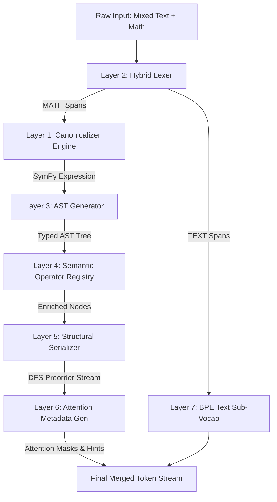

# 🌟 MathTok: Canonicalized AST-Based Mathematical Tokenizer Codebase Review

An in-depth structural and architectural analysis of the **MathTok** pipeline located at `c:\Users\surwe\Project\math_token`. This document serves as a comprehensive system review, detailing the mathematical foundations, the 7-layer pipeline design, system components, evaluation metrics, empirical results, and downstream application patterns of MathTok.

---

## 📖 Executive Summary

Standard natural language tokenizers (like Byte-Pair Encoding or SentencePiece) treat mathematical expressions as plain text sequences. This results in **structural fragmentation** (e.g., splitting a variable `VAR_THETA` or operator `OP_ADD` into arbitrary character chunks) and **semantic blindness** (failing to recognize algebraic equivalences like $x + 2 \equiv 2 + x$). 

**MathTok** solves this by introducing a **hybrid, structure-aware tokenization framework** for mathematical language modeling. By constructing an Abstract Syntax Tree (AST) from mathematical expressions, normalizing algebraic equivalences via symbolic mathematics (SymPy), and serializing the tree using Depth-First Search (DFS) preorder traversal, MathTok preserves full mathematical syntax and hierarchy. 

Additionally, MathTok automatically emits **structural attention metadata** for every token position, enabling downstream transformer models to implement tree-based or graph-structured attention patterns without architectural modifications.



---

## 🛠️ The 7-Layer Processing Pipeline

MathTok's core engine is structured into seven distinct modular layers. Every component resides in the [`mathtok/`](file:///c:/Users/surwe/Project/math_token/mathtok) package.

### Layer 1: Canonicalizer Engine
* **Location**: [`canonicalizer.py`](file:///c:/Users/surwe/Project/math_token/mathtok/canonicalizer.py)
* **Role**: Algebraic normalisation and format conversion (LaTeX $\to$ ASCII $\to$ SymPy).
* **Implementation Details**:
  * **Heuristic Format Detection**: Inspects the input for LaTeX syntax (e.g., `\frac`, `\sqrt`, `\sin`, `{`, math delimiters like `$` or `\(`).
  * **Parsing**: Utilizes `sympy.parsing.latex.parse_latex` (with ANTLR4) for LaTeX, falling back to `sympy.parsing.sympy_parser.parse_expr` with standard and implicit multiplication transformations for ASCII.
  * **Normalisation**: Leverages SymPy's symbolic engine to `expand()` products over sums and `simplify()` algebraic expressions. It normalizes operations internally (e.g., transforming subtractions $a - b$ into additions of products $\text{Add}(a, \text{Mul}(-1, b))$, and divisions $a / b$ into multiplications of powers $\text{Mul}(a, \text{Pow}(b, -1))$).
  * **Robustness & Performance**: Employs an LRU cache (default: 512 entries) to prevent redundant parsing and wraps expensive SymPy calls in a `ThreadPoolExecutor` with configurable parsing timeouts (default: 5.0 seconds) to prevent infinite loops on malicious, highly-complex inputs.

### Layer 2: Hybrid Mathematical Lexer
* **Location**: [`lexer.py`](file:///c:/Users/surwe/Project/math_token/mathtok/lexer.py)
* **Role**: Alternating segment segmentation (TEXT spans vs. MATH spans).
* **Implementation Details**:
  * **Stage 1 (Unambiguous Delimiters)**: Extracts LaTeX math environments (double dollar `$$...$$`, inline dollar `$...\$`, bracket `\[...\]`, or parenthesis `\(...\)`).
  * **Stage 2 (ASCII Heuristics)**: Parses remaining text regions using pre-compiled regular expressions matching mathematical patterns (e.g., function calls `sin(...)`, exponents `x^2`, arithmetic boundaries `2*x+1`, relational equations `a+b=c`, and spelled-out Greek variables).
  * **Region Expansion**: Expands detected math seeds backwards to include leading unary operators and digits, and forwards to match balanced braces/parentheses and continuous math characters. Adjacent spans of identical types are merged.

### Layer 3: AST Generator
* **Location**: [`ast_generator.py`](file:///c:/Users/surwe/Project/math_token/mathtok/ast_generator.py)
* **Role**: SymPy AST conversion to typed, abstract vocabulary trees.
* **Implementation Details**:
  * Walks the SymPy internal expression tree recursively.
  * Maps generic SymPy types into the vocabulary of MathTok:
    * **Variables**: Standard letters map to `VAR_X`, `VAR_Y`, etc. Spelled-out Greek names map to `VAR_THETA`, `VAR_LAMBDA`, etc.
    * **Constants**: Values between $-10$ and $100$ receive dedicated tokens (e.g., `CONST_3`, `CONST_12`), large integers map to placeholders (e.g., `NUM_145`), floats map to string-encoded float tokens (e.g., `FLOAT_3p14`), and special constants map to `CONST_PI`, `CONST_E`, `CONST_I`, and `CONST_INF`.
    * **Unary Operations**: Converts negative numbers or multiplication by $-1$ to explicit `OP_NEG` nodes, and division inverses to `OP_RECIP` nodes.
    * **Fractions**: Converts `Rational(p, q)` into explicit binary `FRAC(numerator, denominator)` nodes.
  * **Recursion Guard**: Enforces `max_depth` limits (default: 20) to truncate overly-nested expressions, replacing them with a special `SUBTREE_TRUNCATED` node to avoid Python stack overflows.

### Layer 4: Semantic Operator Registry
* **Location**: [`operator_registry.py`](file:///c:/Users/surwe/Project/math_token/mathtok/operator_registry.py)
* **Role**: Rich metadata storage and categorisation for mathematical operators.
* **Implementation Details**:
  * Maintains an immutable registry of `OperatorMeta` instances mapping token strings to mathematical properties:
    * **Properties**: `arity` ($-1$ for variadic, or fixed integers like 1 or 2), `precedence`, `associativity` (left, right, or none), `semantic_role` (e.g., `aggregation` for addition, `periodic_oscillation` for sine), `latex_repr`, `ascii_repr`, `category`, and `is_commutative`.
    * **Domains**: Spans multiple mathematical branches: Arithmetic, Relational, Calculus, Trigonometry, Exponential/Logarithmic, Logic, Set Theory, Geometry, and Statistics.
    * **Inverses**: Declares explicit mathematical inverses in `INVERSE_PAIRS` (e.g., `FUNC_SIN` $\leftrightarrow$ `FUNC_ASIN`, `FUNC_EXP` $\leftrightarrow$ `FUNC_LOG`).

### Layer 5: Structural Serializer
* **Location**: [`serializer.py`](file:///c:/Users/surwe/Project/math_token/mathtok/serializer.py)
* **Role**: Flattening the 2D tree structure into a 1-D stream using DFS preorder traversal.
* **Implementation Details**:
  * Emits nodes starting from the root down to the leaves, producing a flat sequence of `SerializedToken` objects carrying: `depth`, `node_id`, `parent_id`, `child_index`, `num_children`, `is_leaf`, and `subtree_size`.
  * **Scope Delineation**: Emits `[SCOPE_OPEN]` and `[SCOPE_CLOSE]` boundary tokens to explicitly group parameters for functions (e.g., `FUNC_SIN [SCOPE_OPEN] VAR_X [SCOPE_CLOSE]`).
  * **Subtree Deduplication**: Integrates MD5 structural hashing (`dedup_subtrees`) to replace duplicated structures (e.g., repeating sub-formulas) with a pointer reference (e.g., `SUBTREE_REF_ae34df51`), improving sequence compression.

### Layer 6: Structural Attention Metadata Generator
* **Location**: [`metadata.py`](file:///c:/Users/surwe/Project/math_token/mathtok/metadata.py)
* **Role**: Calculating positional contexts and binary attention mask matrices.
* **Implementation Details**:
  * Classifies tokens into categories: `operator`, `function`, `variable`, `constant`, `structural`, `boundary`, or `text`.
  * Generates a dot-separated positional hierarchy string for each node in `tree_position_key` (e.g., `0.1.2` denotes root $\to$ 2nd child $\to$ 3rd child), which is useful for hierarchical positional encodings.
  * **Attention Mask Matrix Synthesis**: Dynamically compiles four $N \times N$ binary attention mask matrices:
    * `parent_mask`: Direct dependency attention.
    * `children_mask`: Inverse dependency attention.
    * `sibling_mask`: Horizontal syntactic context attention.
    * `subtree_mask`: Complete structural scope attention.

### Layer 7: Vocabulary & BPE Compression
* **Location**: [`vocabulary.py`](file:///c:/Users/surwe/Project/math_token/mathtok/vocabulary.py)
* **Role**: Merging deterministic structural math vocabularies with Byte-Pair Encoding (BPE) text sub-vocabularies.
* **Implementation Details**:
  * **Two-Tier Architecture**:
    * **Tier 1 (Fixed Math Vocabulary)**: Reservoirs of deterministic, immutable IDs for standard operators, Greek/Latin variables, constants, boundaries, and placeholders. BPE is completely bypassed for math terms.
    * **Tier 2 (BPE Text Vocabulary)**: Natural language regions are processed via HuggingFace's `tokenizers` library, trained on corpus-specific text spans.
  * **HuggingFace Wrapper**: Under the hood, `MathTokHFTokenizer` acts as a drop-in subclass wrapper for `PreTrainedTokenizer`, enabling immediate integration into standard pipelines such as `transformers.Trainer`, `datasets.map`, and PyTorch collators.

---

## 🔄 Verification & Streaming Sub-systems

Beyond the core layers, MathTok implements crucial sub-systems to guarantee mathematical correctess and scale.

### Round-Trip Validation
* **Location**: [`validator.py`](file:///c:/Users/surwe/Project/math_token/mathtok/validator.py)
* **Role**: Guaranteeing zero semantic information loss during tokenization.
* **Implementation Details**:
  * Uses the emitted `TokenMetadata` sequence to mathematically reconstruct the original SymPy expression.
  * Rebuilds leaf nodes based on their category (constants, variables, truncations) and moves upwards to reconstruct complex nodes (`FRAC`, operators, custom functions).
  * Performs formal validation by checking if the algebraic difference between the original and reconstructed expressions simplifies to zero (`sp.simplify(original - reconstructed) == 0`).

### Streaming Pipeline
* **Location**: [`streaming.py`](file:///c:/Users/surwe/Project/math_token/mathtok/streaming.py)
* **Role**: Corpus-scale processing of large datasets without exhausting system memory.
* **Implementation Details**:
  * Wraps `MathTokPipeline` inside a lazy Python generator (`yield`).
  * Supports encoding custom iterators and streams line-delimited files sequentially, ensuring constant memory ($O(1)$ RAM) overhead during dataset processing.

---

## 📈 Evaluation Suite & Benchmark Metrics

The [`evaluation/`](file:///c:/Users/surwe/Project/math_token/evaluation) package defines five core evaluation metrics (residing in [`metrics.py`](file:///c:/Users/surwe/Project/math_token/evaluation/metrics.py)) to assess tokenizer quality, benchmarked in [`comparison.py`](file:///c:/Users/surwe/Project/math_token/evaluation/comparison.py).

### Core Metrics

| Metric | Symbol | Definition & Formula | Mathematical Value |
| :--- | :---: | :--- | :--- |
| **Structural Compression Ratio** | **SCR** | $\text{mean}\left(\frac{\text{Structural Score}}{\text{Token Count}}\right)$ | Quantifies structural information density. Higher is better (more structure packed into fewer tokens). |
| **Canonical Consistency Score** | **CCS** | $\text{mean}\left( \text{Jaccard}(S_A, S_B) \right)$ over equivalent pairs | Evaluates algebraic invariance. A score of $1.0$ represents perfect semantic convergence. |
| **Operator Preservation Score** | **OPS** | $\%$ of expressions containing all expected operators | Measures robustness; ensures mathematical operations are never lost or corrupted. |
| **Token Stability** | **TS** | $1 - \text{Coefficient of Variation}(\text{length})$ | Assesses syntactic variance stability under re-writings. Higher is more stable. |
| **Tree Depth Fidelity** | **TDF** | $1 - \text{mean}\left( \frac{\vert d_{\text{actual}} - d_{\text{ground}} \vert}{d_{\text{ground}}} \right)$ | Measures max metadata depth accuracy against the ground truth SymPy height. |

> [!NOTE]
> **Semantic Compression Ratio (SCR)** is evaluated at three hierarchical levels in `comparison.py`:
> * **Level 1 — Structural Score to Token Ratio**: `structural_score / token_count`
> * **Level 2 — Semantic Density**: `math_tokens / total_tokens`
> * **Level 3 — Structural Efficiency**: `parent_child_relations / token_count`

---

## 🔬 Empirical Benchmark Results

Empirical comparisons of MathTok against a standard subword tokenizer (GPT-2 BPE), a custom-trained SentencePiece (unigram) tokenizer, and character-level baselines over 70 complex test expressions across multiple disciplines reveal substantial improvements.

### 1. 3-Level Semantic Comparison (Aggregated)

Across the entire evaluation suite, the aggregated results illustrate MathTok's efficiency:

| Metric | MathTok | GPT-2 | SentencePiece | Character-Level |
| :--- | :---: | :---: | :---: | :---: |
| **Level 1 — SCR** (struct_score / tokens) | **0.9161** | 0.4251 | 0.3696 | 0.4005 |
| **Level 2 — Semantic Density** (math / total) | **0.5633** | 0.1838 | 0.1499 | — |
| **Level 3 — Structural Efficiency** (relations / tokens) | **0.2492** | *N/A* | *N/A* | — |
| **SCR Improvement Factor** (MathTok vs. Baseline) | **—** | **2.16x** | **2.48x** | **2.29x** |

### 2. Canonical Convergence & Consistency (Jaccard Overlap)

For mathematically equivalent pairs, MathTok achieves perfect Jaccard alignment (Jaccard = 1.0), whereas standard text-based tokenizers suffer significant fragmentation:

| Expression Pair | MathTok Jaccard | GPT-2 Jaccard | SentencePiece Jaccard | Convergence Status |
| :--- | :---: | :---: | :---: | :---: |
| `x + 2` vs. `2 + x` | **1.000** | 0.200 | 1.000 | **CONVERGED (100%)** |
| `a*b + a*c` vs. `a*(b+c)` | **1.000** | 0.444 | 0.625 | **CONVERGED (100%)** |
| `(x+1)^2` vs. `x^2+2x+1` | **1.000** | 0.273 | 0.222 | **CONVERGED (100%)** |
| `x^2 - y^2` vs. `(x+y)*(x-y)` | **1.000** | 0.091 | 0.300 | **CONVERGED (100%)** |
| `sin(x)^2 + cos(x)^2` vs. `1` | **1.000** | 0.000 | 0.000 | **CONVERGED (100%)** |
| `2*x + 2*y` vs. `2*(x+y)` | **1.000** | 0.444 | 0.571 | **CONVERGED (100%)** |
| `x*y + x*z` vs. `x*(y+z)` | **1.000** | 0.444 | 0.625 | **CONVERGED (100%)** |
| `a^2 + 2*a*b + b^2` vs. `(a+b)^2` | **1.000** | 0.364 | 0.455 | **CONVERGED (100%)** |

### 3. LaTeX vs. ASCII Format Invariance

MathTok perfectly converges inputs in differing representations to identical structural sequences, while subword tokenizers have severe variance:

| ASCII Expression | LaTeX Expression | MathTok same? | MT tokens A/L | GPT-2 tokens A/L | SP tokens A/L |
| :--- | :--- | :---: | :---: | :---: | :---: |
| `sin(x^2)` | `\sin(x^2)` | **YES (1.00)** | **8 / 8** | 6 / 7 | 6 / 6 |
| `sqrt(x^2 + 1)` | `\sqrt{x^2 + 1}` | **YES (1.00)** | **11 / 11** | 9 / 10 | 9 / 9 |
| `log(x)` | `\ln(x)` | **YES (1.00)** | **6 / 6** | 4 / 5 | 6 / 6 |
| `exp(x)` | `e^x` | **YES (1.00)** | **6 / 6** | 4 / 3 | 6 / 3 |
| `x/y` | `\frac{x}{y}` | **YES (1.00)** | **6 / 6** | 3 / 7 | 3 / 9 |
| `int(x^2, x)` | `\int x^2 dx` | **NO (~/fallback)** | **1 / 10** | 8 / 6 | 8 / 7 |
| `diff(sin(x), x)` | `\frac{d}{dx}\sin(x)` | **YES (1.00)** | **6 / 6** | 8 / 11 | 14 / 16 |
| `factorial(n)` | `n!` | **YES (1.00)** | **6 / 6** | 5 / 2 | 11 / 3 |

---

## 🚀 Custom Attention Integration Patterns

The core value of MathTok for downstream machine learning practitioners is the **Layer 6 Attention Hints**. By translating tree relationships into standard masking shapes, model creators can train structure-aware networks natively.

Below are three attention mask designs that can be constructed directly from the outputs of `to_attention_mask_hints()`:

### 1. Parent-Child Hierarchical Mask
Encourages top-down syntactic attention. Nodes are only allowed to attend to their direct parent or child node.

```
       [+ (root)]             Parent Attention Mask Matrix:
        /      \              
     [x]       [3]            [ ] [+ (root)] [x] [3]
      |                       [+ (root)]   1    1   1
    [sin]                     [x]          1    1   0
                              [3]          1    0   1
```

### 2. Sibling Horizontal Mask
Focuses horizontal attention across operands of identical scopes (e.g., connecting operands inside an addition sequence, $a$ and $b$ and $c$, without parent noise).

### 3. Subtree Scope Mask
A highly effective block mask for mathematical reasoning. Restricts attention strictly within a subtree, isolating independent sub-expressions during reasoning loops.

---

## 🎯 Codebase Evaluation & Recommendations

### Key Strengths
1. **Outstanding Structural Integrity**: Modularity is excellent. Clear abstraction separation (canonicalization, tokenization, serialization, and vocabulary grouping) makes codebase expansion extremely straightforward.
2. **HuggingFace Compatibility**: Subclassing/wrapping the standard tokenizer class ensures immediate, zero-friction integration with existing libraries like PyTorch and HuggingFace.
3. **Rigorous Validation**: The inclusion of `validator.py` and the round-trip checking logic demonstrates high development standards.
4. **Reliability Guards**: LRU caches, concurrency thread pools, and recursion limits make this pipeline safe for server-side deployment.

### Recommended Enhancements
* **Vocabulary Extension**: Dynamically augment `_VAR_MAP` in `ast_generator.py` to natively support multi-character variables (e.g., physics variables like $v_{\text{init}}$ or matrix names) without splitting them into generic token placeholders.
* **SymPy Parser Customisation**: SymPy's LaTeX parser can occasionally fail on non-standard, custom LaTeX macros. Adding pre-processing ASCII/LaTeX regex cleaners in `lexer.py` prior to passing them to SymPy will improve the parse success rate of dirty online forum data.
* **TDF Precision**: In case of multi-nested subtrees (e.g., highly deeply-nested fractions), customize the tree depth calculation in `metrics.py` to evaluate structural depths on custom mathematical representations rather than internal SymPy structures.

---

### Citation Reference
```bibtex
@article{mathtok2026,
  title   = {MathTok: A Hybrid Canonicalized AST-Based Tokenization Framework
             for Mathematical Language Modeling},
  author  = {Anonymous},
  year    = {2026},
  note    = {Under review}
}
```
